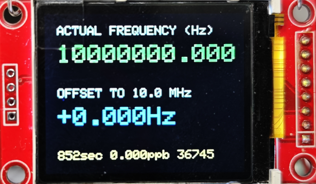
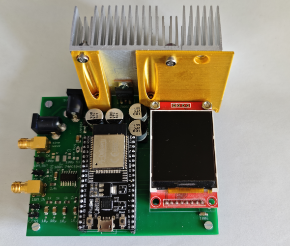
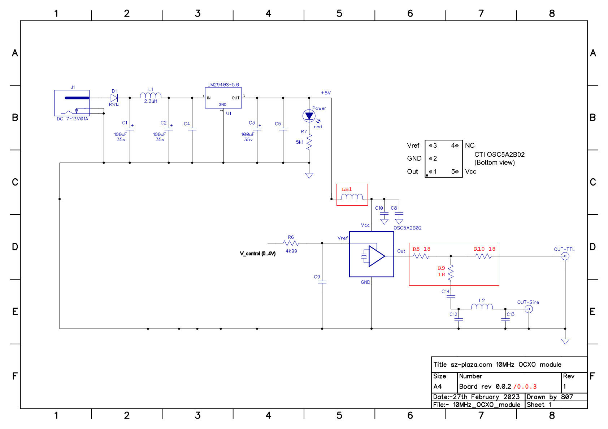
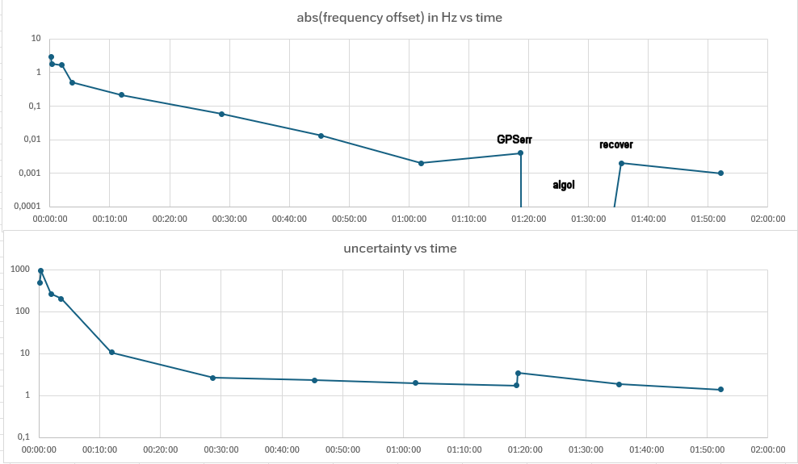

# About
Project goal is a small budget hobbyists GPS disciplined 10MHz XCXO with less than 0.01Hz freq offset at 10MHz using a GPS receiver with 1PPS output.

# Ingredients
- an cheap 10MHz OCXO with 0..4 volts V_control input, which has in it's voltage control range the center freq of 10.000000 MHz and CMOS or TTL output,
  costs at common market places ~15€. I use an CTI OSC5A2B02 OCXO based board. It needs to be modified however, to have a control voltage input instead of a potentiometer.
- an ESP32 devkit C V4, ~12€ (mine was ~8€)
- Arduino IDE with a few libs, 0€, but some efforts in/plus time/research.
- a GPS module with an 1 pulse per second output, in my case
  - Sparkfun GPS-17285 module (Neo-M9N)
  - Sparkfun GPS-14986 antenna
- a few electronic components
- an old 1.8 inch TFT based on St7735, i use the one with the large SD card slot, ~6€
- the PCB, design is here, ~25€ for 5 pieces.
- a 9..12volts DC power supply with ~1amp continously, - no costs. Everybody has such one laying around. Preferred with the 5.5mm 'DC connector', plus is inner.

# How it is working
- the 1PPS signal from the GNSS / GPS module triggers an interrupt routine, which resets a counter.
- the 10MHz signal is counted by the ESP32 specific hardware counter PCNT. Every 30000 counts, this counter fires a second ISR to count it's overflows.
  This ISR is called 333 times a second.
- if the gate time is over, we remember the current counter value (0..29999) as 'last_counter' and calculate the number of pulses: pulses = current_counter + overflows * 30000 - last_counter
- now, we can calculate the frequency: frequency = pulses / gate_time
- and the current frequency error in ppb: errorPPB = (measuredFreq - TARGET_FREQ) / (TARGET_FREQ / 1e9)
- as our OCXO is voltage controlled by 0..4volts, we need to generate a control voltage. We generate a 16-bit PWM, again using hardware counters of the ESP32.
- the pwm signal is RC filtered, we need to put a bit effort in this filter. We want more than 120dB frequency suppression for the PWM frequency.
- and finally, we somehow need to map an error in ppb to an PWM value. This job serves a digital filter with a bit brain, the Kalman filter.
- if the OCXO is learned, the program stores from time to time the current state

# Modification of the OCXO board
My OCXO board doesnt have a control voltage input. Instead, the input is wired to a potentiometer. The modified circuit is shown below.

NOTE: the original schematic was not done by me, see doc folder for original.

# Performance
- for my system, which is a very early breadboard-like assembly
- the algorithm needs time to adapt the OCXO, learn it's properties, so it's slow. Don't expect good results in less than two hours.
- there are still plenty of knobs to tune
- we need the OCXO control signal as clean as possible, so shielding and good RC filtering is mandatory.
- TODO
  - improve GPS quality (cheap module)
  - tune code, if GPS loss or invalid values.
 

| Running hh:mm:ss | abs(FreqOffset), Hz | PWM change 0..65535 | Uncertainty | comment |
| ----------- | ---------------- | ---------- | ----------- | -------- |
| 00:00:10    | 2.9              | 4751       | 490.8       |          |
| 00:00:20    | 1.8              | 2949       | 947.4       |          |
| 00:02:00    | 1.65             | 2703       | 264.0       |          |
| 00:03:40    | 0.51             |  836       | 205.7       |          |
| 00:12:00    | 0,216            |  354       |  10.7       |          |
| 00:28:40    | 0.058            |   95       |   2.65      |          |
| 00:45:20    | 0.013            |   21       |   2.31      |          |
| 01:02:00    | 0.002            |    3       |   1.9982    |          |
| 01:18:40    | 0.040            |    7       |   1.726     | GPS err  |
| 01:18:50    | 0                |    0       |   3.4488    | algo!    |
| 01:35:30    | 0.002            |    3       |   1.8489    | recover  |
| 01:52:10    | 0.001            |    2       |   1.3932    |          |

***NOTE NOTE NOTE:***

***This is work in progress. Everything still changes day by day. Success is optional, this is a fully fun based project.***
